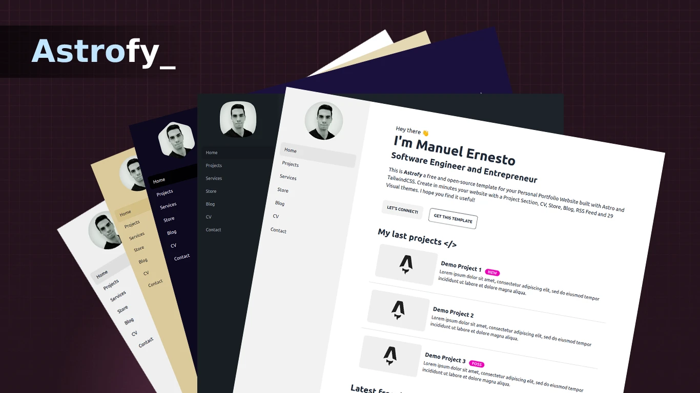

# 林智杰的个人网站



> 一个用 Astro + TailwindCSS 搭建的个人主页，包含博客、CV、项目集和合集功能。

线上：https://jolza.github.io/

## 技术栈

- **[Astro](https://astro.build/)** 4.x — 静态站点框架，零 JS 默认
- **[TailwindCSS](https://tailwindcss.com/)** + **[daisyUI](https://daisyui.com/)** — 样式与主题
- **[Astro Content Collections](https://docs.astro.build/en/guides/content-collections/)** — 类型安全的 Markdown 内容
- **[pinyin-pro](https://pinyin-pro.cn/)** — 中文标题自动转拼音 slug
- **[GitHub Actions](https://github.com/features/actions)** — CI/CD，push 到 main 自动部署
- **[GitHub Pages](https://pages.github.com/)** — 静态托管
- **[Abacus](https://abacus.jasoncameron.dev/)** — 免费阅读计数 API
- **[百度统计](https://tongji.baidu.com/)** — 访客分析

## 功能特性

- 明/暗主题一键切换（`cupcake` / `dracula`，记忆用户偏好）
- 博客支持合集（series）功能，同系列文章自动聚合与上/下篇导航
- 博客列表按年份分组，紧凑时间线布局
- 中文标题自动转拼音 URL（`Spark 调优` → `spark-tiao-you`）
- 文章级和站点级访问计数
- 响应式布局，移动端友好
- Markdown 原生支持，`_` 开头文件自动忽略（可作模板）
- RSS 订阅、SEO 元信息、OpenGraph 完整

## 目录结构

```
├── .github/workflows/
│   └── deploy.yml           # GitHub Actions 自动部署
├── public/                  # 静态资源（图片、favicon）
│   ├── profile.jpg          # 侧边栏头像
│   └── favicon.svg
├── src/
│   ├── components/          # 可复用组件
│   │   ├── SideBar.astro    # 侧边栏（头像 + 导航）
│   │   ├── ThemeToggle.astro # 明暗切换按钮
│   │   └── ...
│   ├── content/
│   │   ├── blog/            # 博客文章 Markdown
│   │   │   └── _TEMPLATE.md # 新文章模板（下划线开头会被忽略）
│   │   └── config.ts        # Content Collection schema
│   ├── layouts/
│   │   ├── BaseLayout.astro # 全局布局
│   │   └── PostLayout.astro # 文章页布局
│   ├── pages/
│   │   ├── index.astro      # 首页 Hero
│   │   ├── projects.astro   # 项目集
│   │   ├── cv.astro         # CV 简历
│   │   └── blog/
│   │       ├── [...page].astro    # 博客列表（分页）
│   │       ├── [slug].astro       # 博客详情
│   │       ├── series/[series].astro  # 合集详情
│   │       └── tag/[tag]/...      # 标签聚合
│   ├── lib/createSlug.ts    # 中文转拼音 slug
│   └── config.ts            # 站点级配置（标题、统计 ID）
├── astro.config.mjs         # Astro 配置
└── tailwind.config.cjs      # Tailwind + daisyUI 配置
```

## 本地开发

```bash
# 1. 克隆
git clone https://github.com/jolza/jolza.github.io
cd jolza.github.io

# 2. 安装依赖（使用了国内镜像，见 .npmrc）
npm install

# 3. 启动开发服务器
npm run dev
# → http://localhost:4321

# 4. 生产构建
npm run build
# 产物在 dist/
```

## 写一篇博客

推荐**直接在 GitHub 网页操作**（无需本地环境）：

1. 打开 [`src/content/blog/_TEMPLATE.md`](src/content/blog/_TEMPLATE.md) 查看模板
2. 在 `src/content/blog/` 下 **Add file → Create new file**
3. 文件名如 `my-post.md`（英文小写-连字符）
4. 粘贴以下 frontmatter 模板并修改：

```markdown
---
title: "文章标题"
description: "一句话摘要（30-80 字最佳）"
pubDate: "Jul 15 2026"        # 英文月份缩写 + 日 + 年
heroImage: "/post_img.webp"   # 可选，不填用默认图
tags: ["标签1", "标签2"]      # 可选
badge: "NEW"                   # 可选：NEW / TUNING / WIP / TIL
series: "合集名"               # 可选：属于哪个合集
seriesOrder: 1                 # 可选：合集内顺序
---

正文写 Markdown 即可。支持代码块、表格、图片、引用块等。
```

5. 页面底部 **Commit changes** → 提交到 main 分支
6. GitHub Actions 自动构建（约 1-2 分钟）→ 上线

**URL 规则**：中文标题自动转拼音，例如 `"Spark 调优"` → `/blog/spark-tiao-you/`。

## 合集功能

给多篇相关文章填相同的 `series` 字段 + 不同的 `seriesOrder`，会自动：

- 在博客列表顶部显示合集胶囊
- 生成 `/blog/series/xxx/` 索引页
- 文章顶部显示合集角标（`第 N/M 篇`）
- 文章底部生成上/下篇导航

示例：

```yaml
series: "Spark 生产调优笔记"
seriesOrder: 1   # 第一篇
```

```yaml
series: "Spark 生产调优笔记"
seriesOrder: 2   # 第二篇（会自动在第 1 篇下方展示"下一篇"链接）
```

## 部署

已配置好 GitHub Actions（`.github/workflows/deploy.yml`），无需手动操作：

- 每次 `git push` 到 `main` 分支
- Actions 自动跑 `npm install` + `npm run build`
- 产物部署到 GitHub Pages
- 约 1-2 分钟后 `https://jolza.github.io/` 更新

**首次配置**（如果 fork 本项目）：
1. 在仓库 Settings → Pages 里，Source 选 **GitHub Actions**
2. 修改 `astro.config.mjs` 里的 `site` 字段为你的域名
3. 修改 `src/config.ts` 里的站点标题
4. Push 触发首次部署

## 主题定制

- 明色 / 暗色主题在 `src/components/ThemeToggle.astro` 的 `THEMES` 常量里配置
- 可选主题：任何 [daisyUI 主题](https://daisyui.com/docs/themes/)
- 头像替换：把新图放到 `public/profile.jpg`
- 主标题渐变色：改 `src/pages/index.astro` 里的 `bg-gradient-to-r from-primary via-secondary to-accent`

## 访客统计配置

**百度统计**：把跟踪 ID 填到 `src/config.ts` 的 `BAIDU_ANALYTICS_ID`，留空则不启用。

**Abacus 阅读计数**：`src/layouts/PostLayout.astro` 和 `src/components/Footer.astro` 里的 `NAMESPACE` 常量控制命名空间，改成自己的即可。

## License

模板改编自 [Astrofy](https://github.com/manuelernestog/astrofy)（MIT License）。
内容部分（`src/content/`）版权归作者所有。
